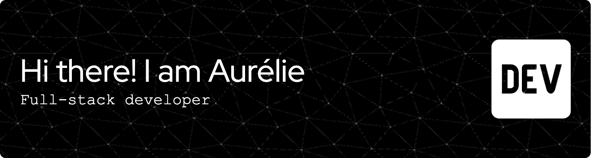

I'm a software developer currently studying at **42**, where I'm building a strong foundation in algorithms, data structures and software engineering through hands-on projects.

Before joining 42, I completed a **MERN Stack** bootcamp and independently developed and deployed a production website for a family business using **Next.js** and **TypeScript**.

I'm looking for my first opportunity as a **Software Developer**, open to work in **Bilbao or remotely**.
I'm fluent in **French (native)**, **Spanish**, and **English**.

🇪🇸 Versión en español

Desarrolladora de software en formación en **42**, donde estoy construyendo una sólida base en algoritmos, estructuras de datos e ingeniería de software a través de proyectos prácticos.

Antes de incorporarme a 42, completé un bootcamp de **MERN Stack** y desarrollé y desplegué de forma independiente una web en producción para una empresa familiar utilizando **Next.js** y **TypeScript**.

Busco mi primera oportunidad como **Software Developer**, en **Bilbao** o en remoto. Hablo **francés (nativo)**, **español** e **inglés** con fluidez.

---

## 🛠️ Tech Stack

| **Languages** | **Backend** | **Web** | **Testing & Code Quality** | **Tools** |
|---------------|-------------|---------|-------------------------------|-----------|
|  |  |  |  |  |
|  |  |  |  |  |
|  |  |  |  |  |
|  |  |  |  |  |
|  |  |  |  |  |

---

## 🧠 Core Concepts

Algorithms • Data Structures • Concurrent Programming • Object-Oriented Programming • Software Design • Unix Programming

---

## 🌟 Featured Projects

<table>
<tr>
<td width="50%" valign="top">

### 🚦 [Codexion](https://github.com/aurelienog/codexion/)

Concurrent scheduler in C featuring POSIX threads and FIFO/EDF scheduling.
</td>

<td width="50%" valign="top">

### 🚁 [Fly-In](https://github.com/aurelienog/fly-in/)

Multi-agent pathfinding simulator using Space-Time A*.  
</td>
</tr>
<tr>
<td valign="top">

### 🧩 [A-Maze-Ing](https://github.com/aurelienog/A-Maze-Ing)

Maze generator and solver implementing Prim, DFS and BFS.
</td>

<td valign="top">

### 🏠 [ANJ Renov](https://www.anj-renov.fr/)

Production website built with Next.js and TypeScript.
</td>
</tr>
</table>

---

## 🎓 42

Current level: **4.05** (Common Core)

Progress: 🟪🟪🟪⬜⬜⬜⬜⬜⬜⬜ 22%

<strong>📚 Completed projects (18)</strong>

 

| Project | Language | Workload | Main topics |
|---------|----------|:--------:|-------------|
| Libft |  | 70H | C Standard Library |
| ft_printf |  | 55H | Variadic Functions |
| get_next_line ⭐ |  | 55H | File I/O |
| push_swap |  | 70H | Sorting Algorithms |
| Born2beroot |  | 50H | System Administration |
| Python Module 00 |  | 4H | Python Fundamentals |
| Python Module 01 |  | 10H | Object-Oriented Programming |
| Python Module 02 |  | 10H | Exception Handling |
| Python Module 03 |  | 15H | Data Structures |
| Python Module 04 |  | 6H | File I/O |
| Python Module 05 |  | 20H | Abstraction & Polymorphism |
| Python Module 06 |  | 7H | Packages & Imports |
| Python Module 07 |  | 7H | Design Patterns |
| Python Module 08 |  | 15H | Virtual Environments |
| Python Module 09 |  | 15H | Pydantic |
| Python Module 10 |  | 15H | Functional Programming |
| A-Maze-ing ⭐ |  | 50H | Prim · DFS · BFS |
| Fly-In ⭐ |  | 120H | Space-Time A* |
| Codexion |  | 80H | POSIX Threads · Scheduling |
| 🚧 Call Me Maybe |  | 80H | Databases · OOP |

⭐ Bonus completed.

---

## 📈 GitHub Stats 

---

## 📫 Let's connect

- 🌐 [Portfolio](https://aurelie-nogueira.vercel.app/)
- 💼 [LinkedIn](https://linkedin.com/in/aurelie-nogueira)
- 📧 aure.software.dev@gmail.com

---

Always learning.  
Always building.
